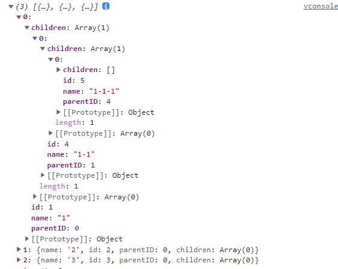

<script setup lang="ts">
    /** 方法描述 */
const methodDescription="根据相同字段名将对象进行分组"
/** 添加版本 */
const addVersion="1.0.0"
</script>


# listToTree

{{methodDescription}}

### 添加版本

{{addVersion}}

### 例子

```typescript
const arr = [
    { name: "1", id: 1, parentId: 0, children: [] },
    { name: "2", id: 2, parentId: 0, children: [] },
    { name: "3", id: 3, parentId: 0, children: [] },
    { name: "1-1", id: 4, parentId: 1, children: [] },
    { name: "1-1-1", id: 5, parentId: 4, children: [] }
]
console.log($$.listToTree(arr, 0, "id"));
```



### 类型定义

```typescript
/**
   * 列表转树
   * @param list 任意数组
   * @param parentId 父级id
   * @param fields 父级本身id
   * @returns 
   */
const listToTree: <T extends {
    parentID: number;
    children: T[];
}>(list: T[], parentId: number, fields: string) => T[]
```
